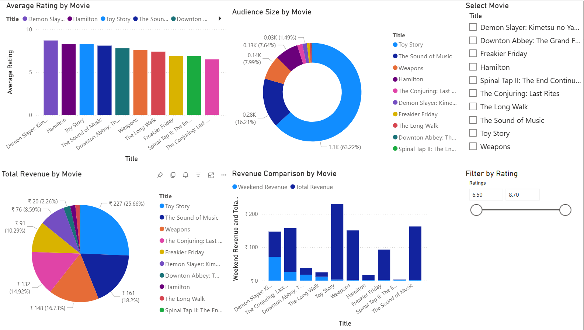
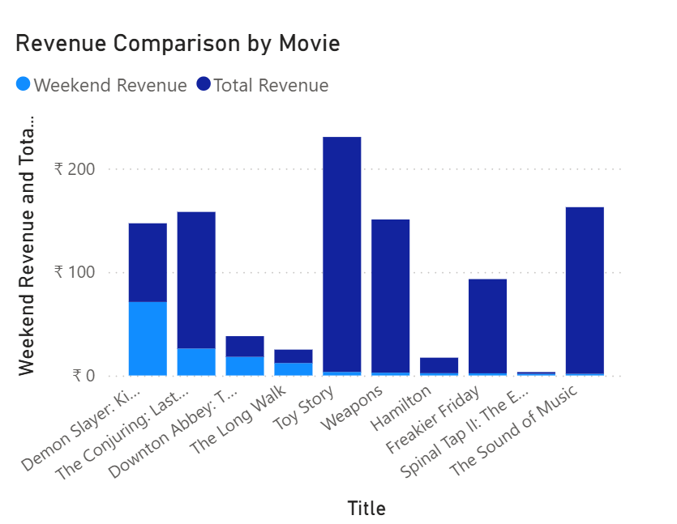

# Movie Analytics Dashboard (Power BI)

## Overview
This project analyzes movie performance using revenue, ratings, and audience engagement metrics. The dashboard allows interactive filtering and comparison across movies.

## Data Source
- Data extracted from a public website using Power BI Web connector

## Tools Used
- Power BI  
- Power Query  

## Features
- Interactive dashboard with multiple visualizations  
- Slicers for filtering by movie title and rating range  
- Revenue comparison (Weekend vs Total Revenue)  
- Audience size and rating analysis  

## Key Insights
- Revenue is concentrated among a few top-performing movies  
- High ratings do not always correspond to highest revenue  
- Audience engagement varies across movies  

## Screenshots

### Full Dashboard

### Revenue Comparison Chart

